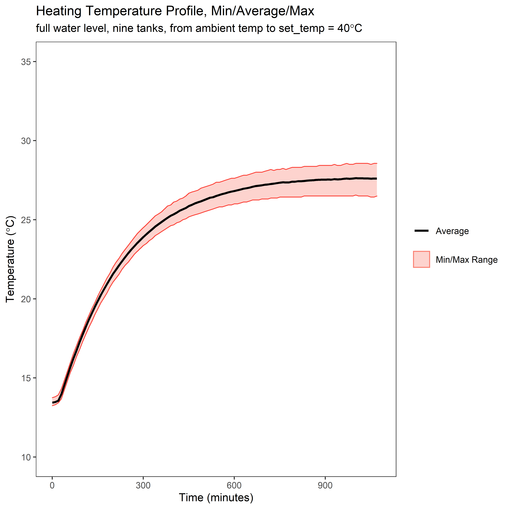
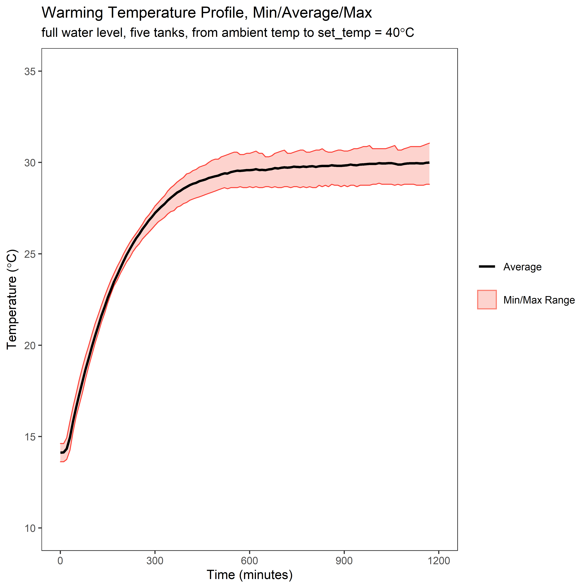
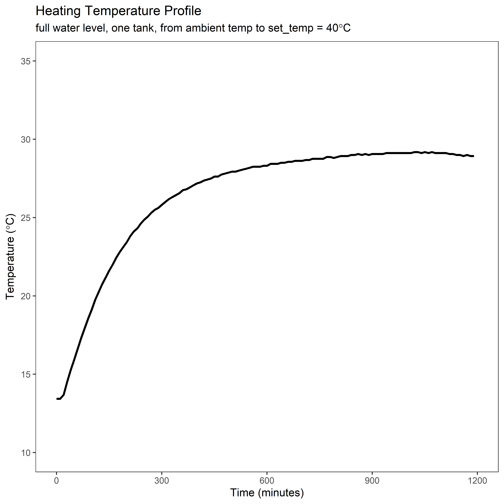
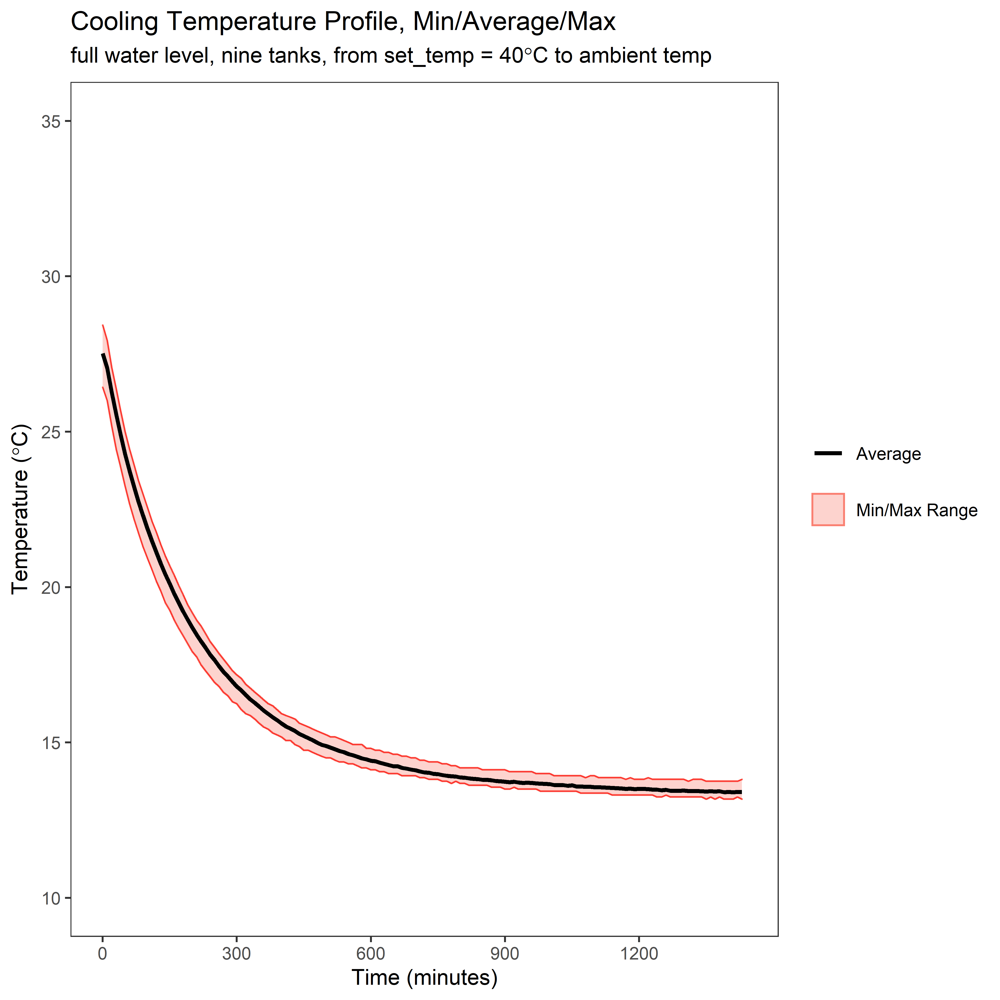
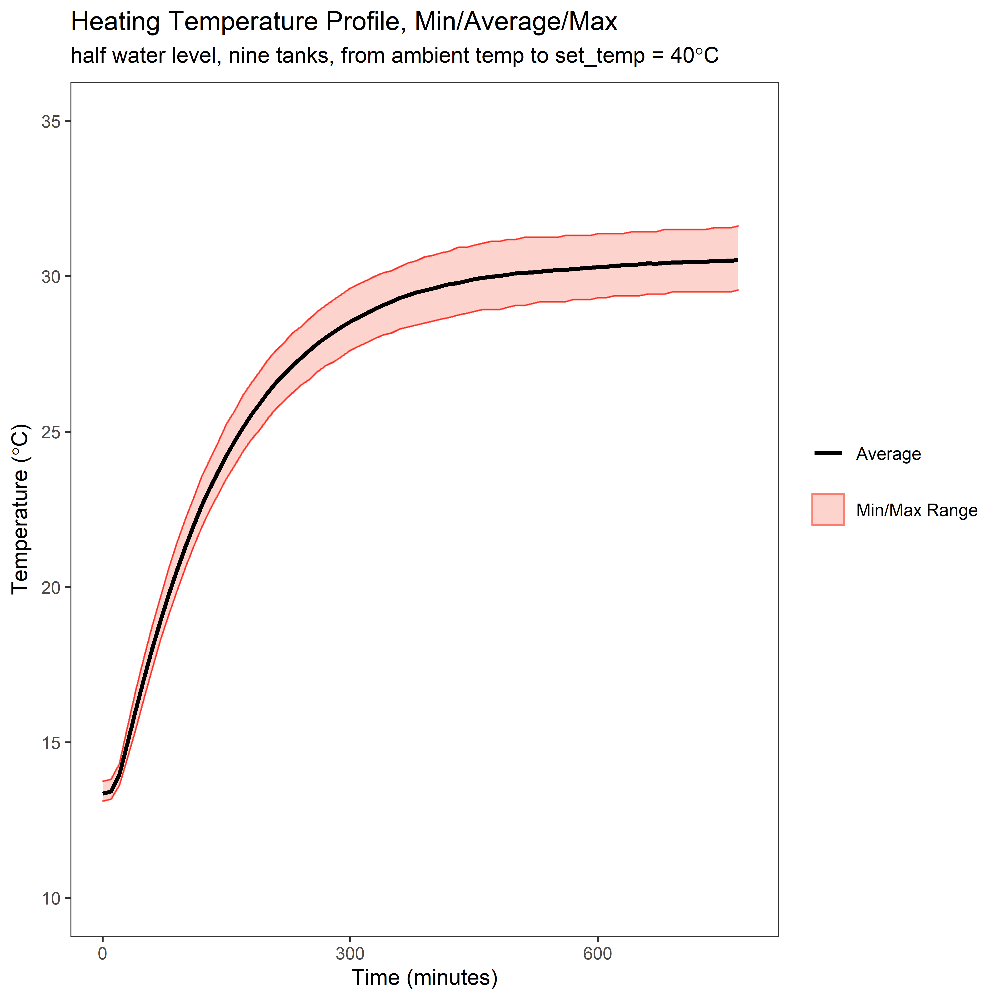
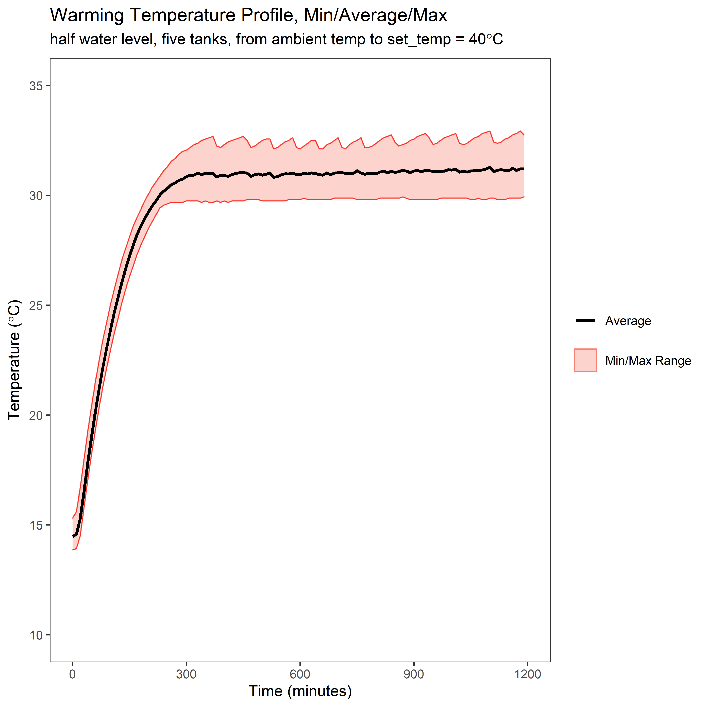
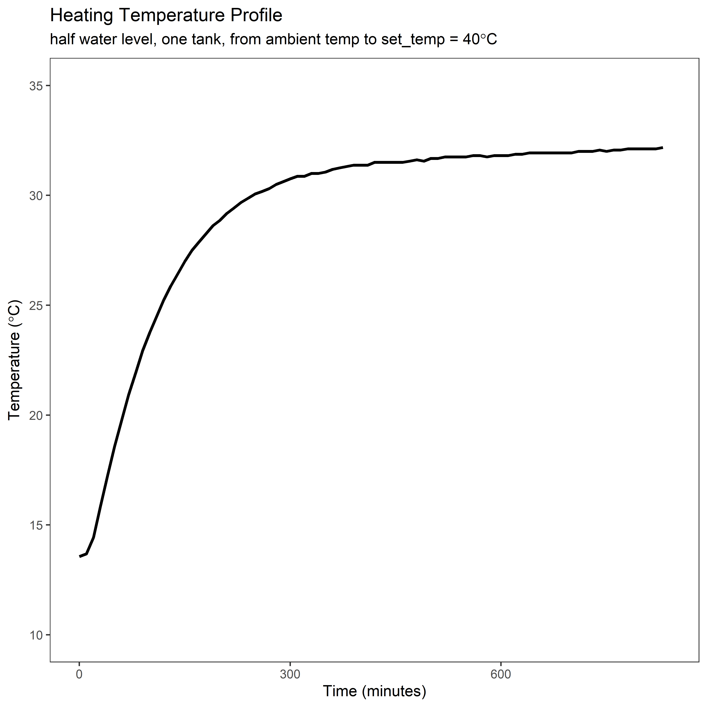
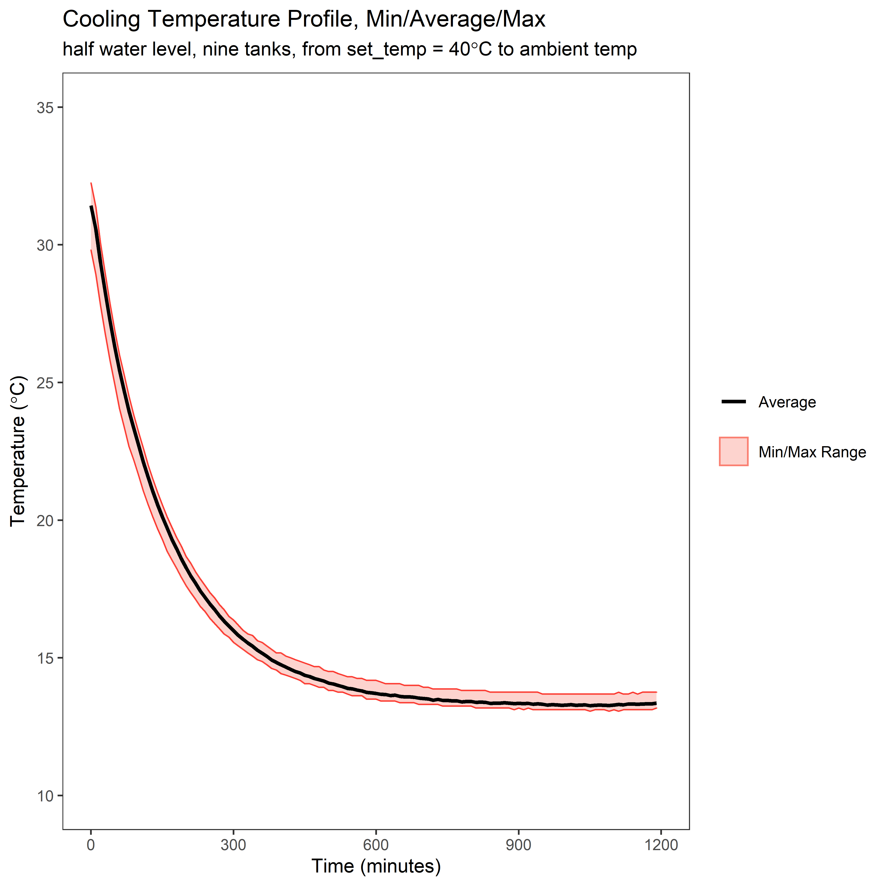

# Diagnostic Data
Collected summer of 2021 to capture the performance metrics of the system.  

### Heating profiles for full tanks

### Heating profiles for half tanks
 

## Setup
Each of these data collections were performed on the same 9.4L tanks over the course of two weeks. The goal was to capture approximate performance of the heating system looking at the heating performance when one, five or all nine tanks were heating, as well as the cooling performance. Heating refers to a set temp of 40 degrees C, cooling refers to settling down to the room's ambient (14 degrees C).

In place of using the full system infrastructure, only one Raspberry Pi / Arduino pair was used, without the need to interface with the main control node (Shia). This singular control pair utilized the `peanut_butter_falcon.py` script to collect the data.

Nine tanks were setup in a representative layout, three side by side on each shelf of the rack. There may be some interesting thermal interactions between the tanks. Tanks on a given shelf were spaced by about 2-4 inches separating on their longest side. This means the 'middle' tank was surrounded above, bellow and on each of its larger surface area sides, leaving only the smallest surfaces exposed. This potential thermal interaction can be seen in the individual tanks in `full_one_c2h`.

Tank layout:  

    -------------------------------
    | Tank 73 | Tank 74 | Tank 75 |
    -------------------------------
    | Tank 76 | Tank 77 | Tank 78 |
    -------------------------------
    | Tank 79 | Tank 80 | Tank 81 |
    -------------------------------

## Performance Runs
As the normal experimental set up of the system often modulates the water level in the tanks to represent hydroperiod these performance collections were performed with tanks at both full water levels (~9.4L) as well as half-water levels. As might be expected, the half full tanks heated up faster.  

Another important factor in the performance was the duty cycling of the heaters to limit peak power. When all 9 heaters were 'turned on' the control arduino would apply a sliding window to make sure that only 5 heaters were on at a given time. This means that the per-tank performance is impacted depending on if one tank is heating up, up to five tanks are heating up, or all nine tanks are heating up.

### Full Water Level

| Run | Location | Plot |
|-----|----------|------|
| All Heating | `./plots/full_all_c2h/` |  |
| Five Heating | `./plots/full_five_c2h/` |  |
| One Heating | `./plots/full_one_c2h/` |  |
| All Cooling | `./plots/full_all_h2c/` |  |

### Half Water Level
| Run | Location | Plot |
|-----|----------|------|
| All Heating | `./plots/half_all_c2h/` |  |
| Five Heating | `./plots/half_five_c2h/` |  |
| One Heating | `./plots/full_one_c2h/` |  |
| All Cooling | `./plots/full_all_h2c/` |  |

## R Scripts and Raw Data
The R scripts used to process these graphs is included as well inside subdirectories.

## Gradient Measurements
Some of the data collected, and outlined in [pbf_notes.md](./pbf_notes.md), was meant to capture the intra-tank heat metrics of the heater and the control temperature probe. Graphs were not deemed necessary for this detail of data. The two images [gradient_iso_7_2021.jpg](gradient_iso_7_2021.jpg) and [gradient_profile_7_2021.jpg](gradient_profile_7_2021.jpg) give a visual representation of the temperature probe fixture described in the notes file.

# Temperature Metrics

From 15% to 85% of total range. This ignores the extremes of the profiles. It should also be noted that the resolution of the temperature probes is about 0.36 degrees.  

| Heating / Cooling | Number of Tanks | Full / Half Water Level | Min/Max/\[Average\] Delta ( $C\degree/hour$ ) | Relevant File |  
|-------------------|-----------------|-------------------------|-----------------------------------------------|---------------|
| Heating | One tank   | Half water |   0.72 / 8.28 / **3.40**          | `pbf_2021_7_6_one_tank_heating_half_water` |
| Heating | One tank   | Full water |   0.36 / 4.14 / **1.78**          | `pbf_2021_7_9_one_tank_cold_to_hot_full_tanks.csv` |
| Heating | Five tanks | Half water |   1.86 / 8.22 / **4.91**          | `pbf_2021_7_9_one_tank_cold_to_hot_full_tanks.csv` |
| Heating | Five tanks | Full water |   0.72 / 4.92 / **2.51**          | `pbf_2021_7_12_five_tanks_warming_full_water.csv` |
| Heating | All tanks  | Half water |   1.5 / 7.08 / **3.21**           | `pbf_2021_6_30_cold_to_hot_all_half.csv` |
| Heating | All tanks  | Full water |   0.36 / 3.72 / **1.70**          | `pbf_2021_7_14_all_cold_to_hot_full_tank.csv` |
| Cooling | All tanks  | Half water |   -0.72 / -7.5 / **-2.91**        | `pbf_2021_6_29_hot_to_cold_halfTank.csv` |
| Cooling | All tanks  | Full water |   -0.36 / -4.5 / **-1.57**        | `pbf_2021_7_15_hot_to_cold_full_tank.csv` |

