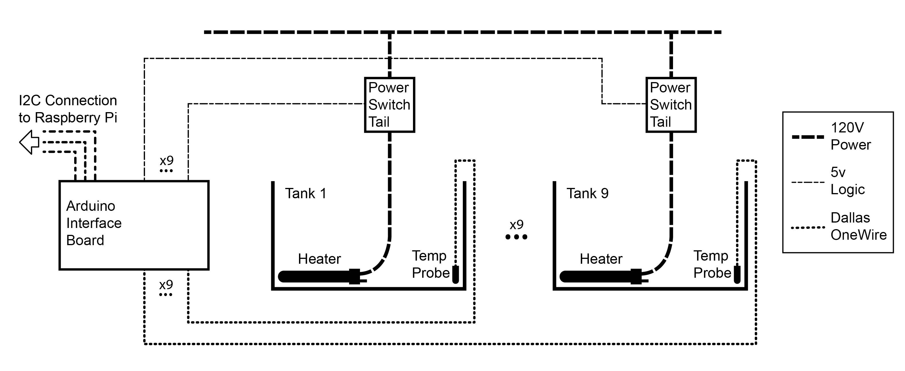
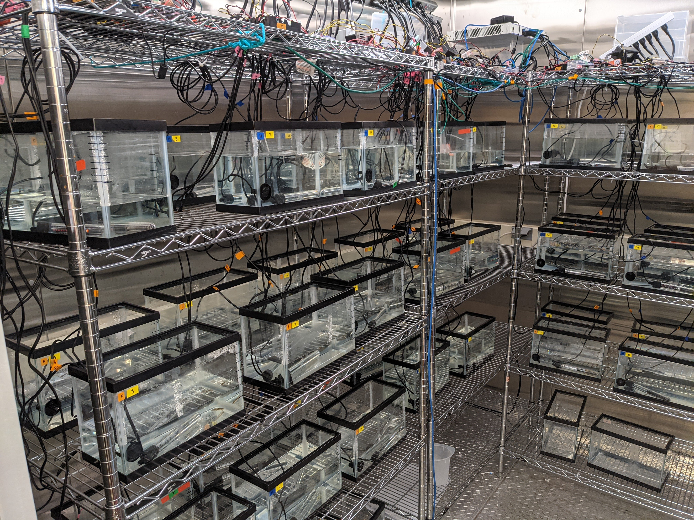

# System Photos and Diagrams
These photos were taken summer of 2021. Diagrams produced Fall of 2021.

| Annotation | Detail | File | Photo / Diagram |
|------------|--------|------|-----------------|
| High level system diagram | Communication over ethernet with Raspberry Pis was utilizing RabbitMQ, communication between RPis and Arduinos was dedicated I2C connections. Each control node monitored and controlled 9 individual tanks. | `./Pi_Diagram.jpg` |  |
| Individual Arduino diagram | Each Arduino connected to nine DS18B20 Temperature Probes and nine power relays (Power Switch Tails). | `./Arduino_Pi_Diagram.jpg` |  |
| Rack Setup | This depiction is for a limited 6 tank per control pair set up. Normally each 'colum' of tanks would have 9 tanks (three on each shelf) not 6 tanks (two on each shelf). Notice placement of heater (lying on side) and temp probe in each tank. | `./rack_setup.jpg` |  |
| Top Shelf | While appears to be chaotic, necessity of connection and power needs made haphazard placement necessary. This was aided by the grid of the shelf giving direct access to the lower tanks. Power strips (top) were needed to augment the limited power in the room. Black boxes (middle) hanging off the power strip are the Power Switch Tails. Clear boxes (lower left) are Raspberry Pi enclosures. Open black boxes with green headers (two on the right) are the Arduino breakout boards. | `./top_shelf.jpg` |  |
| Arduino Breakout Detail | Unconnected wires (blue, green, black) are I2C connections to the Raspberry Pis. Arduino Nano on the lower right, headers for the Dallas OneWire connections (temp probes) on the left, headers for the TTL power switch control on the right. | `./arduino_breakout_detail.jpg` |  |
| Arduino Pi Connection | Fully connected Arduino breakout board. Black lid on bottom left is covering a Raspberry Pi. There had been some issues with the coolant system dripping condensated water on the system. Black cover was a precaution, but also gave a connection point for the I2C connection between the Pi and the Arduino boards. | `./arduino_pi_connection.jpg` |  |