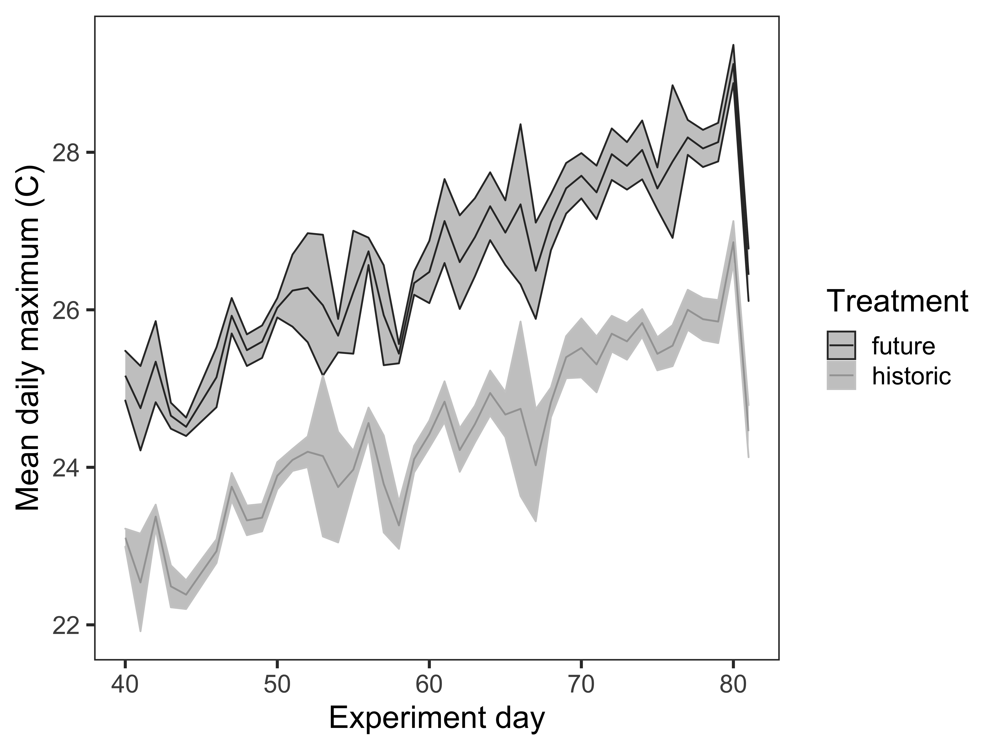
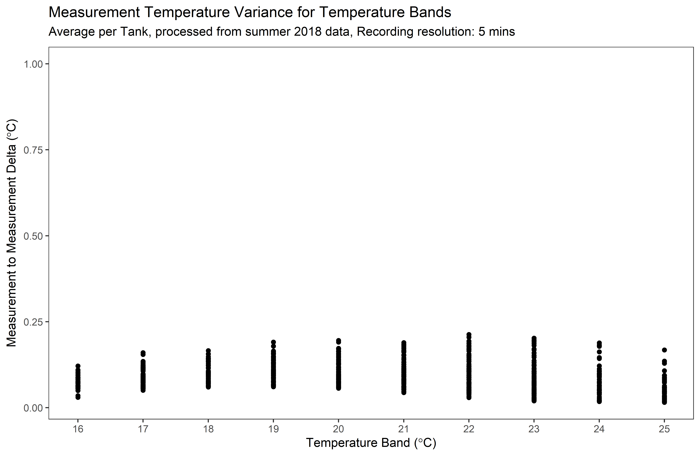
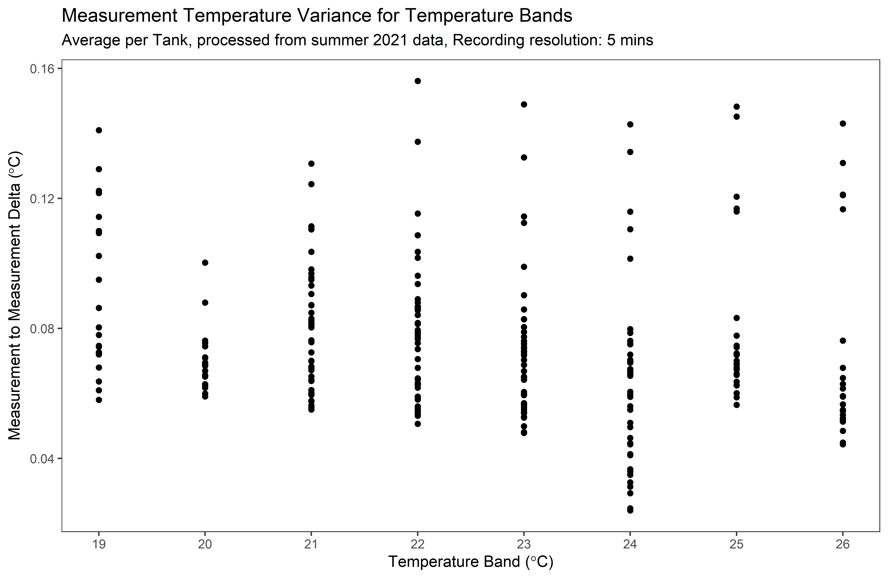
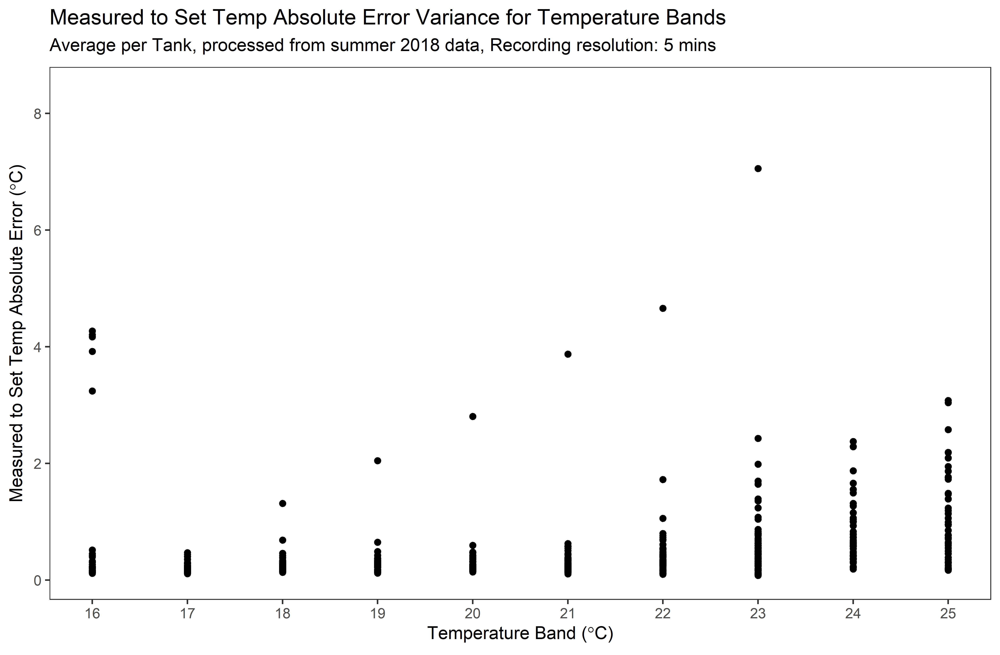
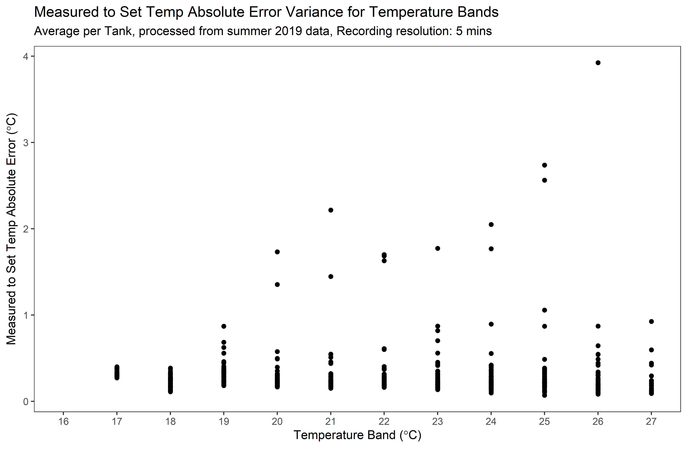
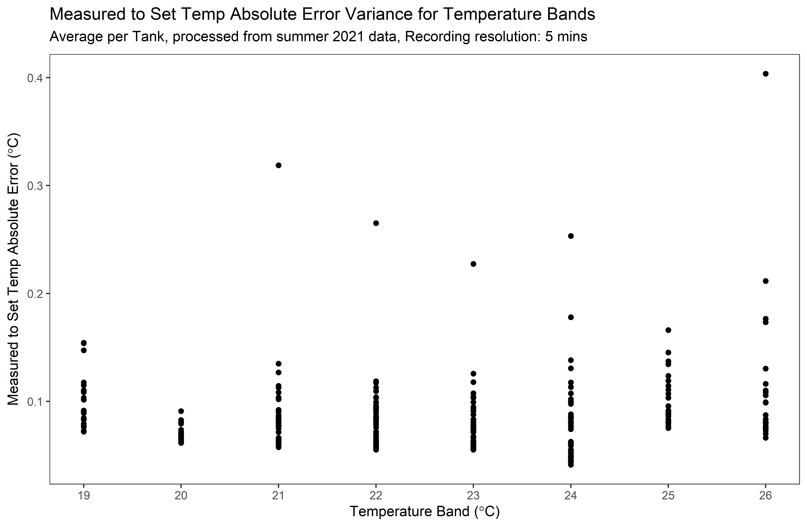

# Temperature Variance by Temperature Band  
Supplementary system performance data.

Example data showing the separation between the Future and Historic treatments. All set-temps within a treatment were the same, so the span (the difference between the min and max temperatures) represents, for the hottest part of a day, the variance between treatments. 

## Overview
A valuable insight into the system is how stable, or steady, the measurement-to-measurement variance in measured temp. Fluctuations in temperature from measurement to measurement may be from a number of different factors: if the water is low, the heater has much less thermal mass to change, so the variance can be pretty high. The higher the water, the more smoothed the heating profile is from measurement to measurement. Additionally the placement of the temperature probe in the tank has a large impact on the overall measured temperature profile (and thus the heater control as well).  

Additionally we are interested in, on average, how far off is the measured temp from the requested set temp. We have also observed that for some high set temperatures the heater is not able to keep up, or limits itself based on an internal thermal cut-off.  

## Plots
The following plots are attempting to visualize how these variations and errors express across the long time frame of an experiment. Each graph's X axis represents different Temperature Bands, or bins. These bins represent the variance within that temperature band. So Temp Band 22 represents all of the measured temperatures that were recorded when the set temp was greater or equal to 22 and less than 23 degrees. The Measurement-to-Measurement plots are recording the average difference between one recording and the next for a given tank. Absolute error plots are recording the average absolute difference between the measured temp and the set temp for a given tank.

Obvious outliers were removed. As an example in 2019, due to the length of the experimental run, there were some single values that were not recorded correctly and one tank which was behaving oddly part of the way through the run.

| Year | Graph Type | File Name | Plot |   
|------|------------|-----------|------|
| 2018 | Measurement Variance | `2018_deltaVarianceByTempBand.png` |  |  
| 2019 | Measurement Variance | `2019_deltaVarianceByTempBand.png` |  | 
| 2021 | Measurement Variance | `2021_deltaVarianceByTempBand.png` |  |  
| 2018 | Absolute Error | `2018_errorVarianceByTempBand.png` |  |   
| 2019 | Absolute Error | `2019_errorVarianceByTempBand.png` |  |  
| 2021 | Absolute Error | `2021_errorVarianceByTempBand.png` |  |  

